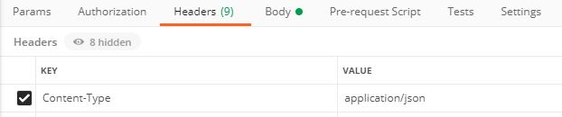
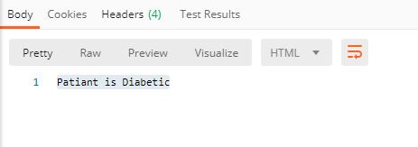

# RestAPI-Postman

## Table of Content
  * Overview
  * Technical Aspect
  * Installation
  * Run
  * Setup Postman
  * Directory Tree
  * Technologies Used
  
### Overview
Machine Learning models are powerful tools to make predictions based on available data. To make these models useful, they need to be deployed so that other’s can easily access them through an API (application programming interface) to make predictions.
A REST API  that uses HTTP requests to GET, PUT, POST and DELETE data.

### Technical Aspect
For this project I build simple Logistic Regreesion to predict Diabetic Patients and deploy it with Flask Framework in local host. API is accessed by Postman.

### Installation
The Code is written in Python 3.7. To install the required packages and libraries, run this command in the project directory after cloning the repository:

   pip install -r requirements.txt

### Run
To run use this command in you virtualenv

  python app.py
  
### Setup Postman
**Method**


  **Content**

  

  **Body**
  ```json
  {
    "data":{
        "Pregnancies": 6,
        "Glucose" : 148.0,
        "BloodPressure" : 72.0,
        "SkinThickness" : 35.0,
        "Insulin" : 79.79,
        "BMI" : 33.6,
        "DiabetesPedigreeFunction": 0.627,
        "Age" : 50
    }
  }
  ```
  
   **Response** 
    
   
  
### Directory Tree
  
    ├── LogisticRegression 
    │   ├── LogisticRegression.py
    ├── app.py
    ├── diabetes.csv
    ├── Logistic Regression.ipynb
    ├── modelForPrediction.sav
    ├── requiremntes.txt
    ├── README.md
    └── standardScalar.sav
    
 ### Technologies Used
 
 


